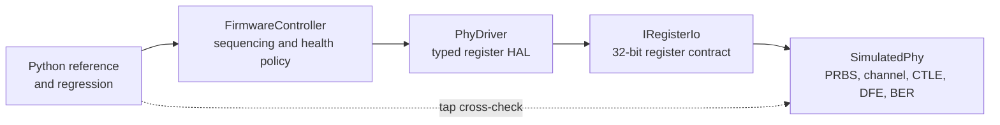

# SERDES Firmware Adaptation Lab

[](https://github.com/MarvelousJade/serdes-firmware-lab/actions/workflows/ci.yml)
[](https://isocpp.org/)
[](LICENSE)

An embedded-style C++20 firmware prototype that brings up and monitors a behavioral NRZ SERDES PHY through a typed 32-bit register interface.

The controller waits for PLL lock, sweeps CTLE settings, trains a three-tap DFE, verifies a confidence-aware BER target, and requests retraining after persistent offline BERT failures. A deterministic Python reference model cross-checks tap convergence.

> This is a host-side firmware and verification project, not a transistor-level model or evidence of post-silicon performance.

## Engineering highlights

- Explicit bring-up and recovery state machine with bounded timeouts and fault reasons
- Hardware-abstraction layer designed for replaceable MMIO, SPI, or mailbox backends
- Fixed-width registers, signed tap encoding, saturation, and deterministic seeded replay
- PRBS31 traffic, synthetic channel/noise profiles, CTLE sweep, DFE adaptation, and BER estimation
- Cross-platform CI, 50 C++ checks, Python reference tests, and multi-seed regression

## Measured results

The checked-in regression covers 75 deterministic runs across three synthetic channels and 25 seeds, using 500,000-symbol baseline and trained verification windows.

| Channel | Passing runs | Median baseline BER | Maximum trained BER | Maximum tap error |
|---|---:|---:|---:|---:|
| Short | 25/25 | 0 observed | 0 observed | 0 codes |
| Medium | 25/25 | `9.168e-2` | 0 observed | 0 codes |
| Long | 25/25 | `2.000e-1` | `3.600e-5` | 1 code |

All 75 runs met the configured `1e-3` BER acceptance target. The worst approximate one-sided 95% upper estimate was `5.292e-5`; zero-error windows use the rule-of-three estimate rather than claiming true BER is zero. See [the validation record](docs/validation.md) for the full methodology and limitations.

## Design



```text
RESET -> WAIT_FOR_PLL -> CTLE_SWEEP -> DFE_TRAINING -> VERIFY -> LINK_UP
                                                                  |
                   retrain request <- DEGRADED <- persistent BERT failures
```

Firmware consumes block-level counters and correlations; the simulated PHY owns symbol processing. This keeps the controller realistic about the firmware/hardware boundary. See [architecture](docs/architecture.md) and the [register map](docs/register-map.md) for details.

## Build and run

Requirements: CMake 3.20+, a C++20 compiler, and Python 3.10+.

```powershell
cmake -S . -B build -DCMAKE_BUILD_TYPE=Release
cmake --build build --config Release
ctest --test-dir build -C Release --output-on-failure
```

Run a channel scenario:

```powershell
./build/serdes_lab.exe --profile medium --seed 42
```

Reproduce the 75-run regression:

```powershell
python python/run_regression.py `
  --executable build/serdes_lab.exe `
  --seeds 25 `
  --verify-symbols 500000
```

On single-config Linux generators, omit `-C Release` and run `./build/serdes_lab`.

## Scope

The behavioral model intentionally omits continuous-time analog effects, CDR, jitter, crosstalk, PAM4, PVT variation, protocol training, and real hardware access. Synthetic profiles are test fixtures, not measured channels, and the regression is functional validation rather than compliance-grade BER testing.

Built with C++20, CMake, CTest, Python, and GitHub Actions. Licensed under the [MIT License](LICENSE).
