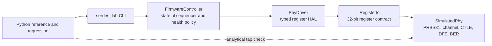

# SERDES Firmware Adaptation Lab

An embedded-style C++20 controller that brings up a behavioral NRZ SERDES PHY through a memory-mapped register interface. The host-side firmware prototype waits for PLL lock, sweeps a discrete CTLE codebook, trains a three-tap DFE from block-level error correlations, verifies a BER confidence estimate, and requests retraining after persistent failures in offline PRBS/BERT health checks. A Python analytical model and regression runner cross-check tap convergence across deterministic runs.

This is a system-level firmware and verification prototype. It is not a transistor-level model, an IBIS-AMI implementation, or evidence of post-silicon operation.

## Measured results

The checked-in algorithms were tested over 75 deterministic runs: three fixed synthetic channel profiles, seeds 1–25, and 500,000 symbols in each baseline and trained verification window.

| Channel | Runs passing | Zero-error trained windows | Median baseline BER | Median trained BER | Maximum trained BER | Maximum tap-code error |
|---|---:|---:|---:|---:|---:|---:|
| Short | 25/25 | 25/25 | 0 observed | 0 observed | 0 observed | 0 |
| Medium | 25/25 | 25/25 | 9.168e-2 | 0 observed | 0 observed | 0 |
| Long | 25/25 | 3/25 | 2.000e-1 | 1.000e-5 | 3.600e-5 | 1 |

All 75 runs met the configured `1e-3` acceptance target using an approximate one-sided 95% BER upper estimate, rather than observed BER alone. In total, 53/75 trained windows observed zero errors; the worst observed trained BER was `3.600e-5`, and the worst upper estimate was `5.292e-5`. Learned DFE taps stayed within one register code of coefficients calculated by the matching Python equations. A zero-error 500,000-symbol window uses the rule-of-three value `3/N = 6.000e-6`; it is not proof that true BER is zero.

Reproduce these numbers with:

```powershell
python python/run_regression.py `
  --executable build/serdes_lab.exe `
  --seeds 25 `
  --verify-symbols 500000
```

The runner writes per-scenario data to `artifacts/regression.csv` and a concise report to `artifacts/summary.md`.

## Architecture



The separation is deliberate: the simulated PHY processes symbols and accumulates metrics, while firmware reads block-level counters/correlations and programs bounded tap codes. The firmware does not pretend to process a multi-gigabit symbol stream directly.

Bring-up follows:

```text
RESET -> WAIT_FOR_PLL -> CTLE_SWEEP -> DFE_TRAINING -> VERIFY -> LINK_UP
              |              |              |            |
              +--------------+--------------+------------+-> FAULT

LINK_UP -> persistent failing offline BERT windows -> DEGRADED -> retrain request
```

Implementation details, equations, and ownership boundaries are in [docs/architecture.md](docs/architecture.md). The complete synthetic register contract is in [docs/register-map.md](docs/register-map.md).

## Build and test

Requirements: CMake 3.20+, a C++20 compiler, and Python 3.10+.

```powershell
cmake -S . -B build -G Ninja -DCMAKE_BUILD_TYPE=Release
cmake --build build
ctest --test-dir build --output-on-failure
```

Run one scenario:

```powershell
./build/serdes_lab.exe --profile medium --seed 42
```

Example output:

```text
State trace: RESET -> WAIT_FOR_PLL -> CTLE_SWEEP -> DFE_TRAINING -> VERIFY -> LINK_UP
Baseline BER: 9.070e-02 (18141/200000)
Trained BER:  0.000e+00 (0/200000)
Approximate one-sided 95% BER upper estimate: 1.500e-05
CTLE code: 4
DFE tap codes: [13, -36, 17]
Training windows: 17
Result: PASS (none)
```

CI is configured for GCC/Linux and Windows builds. Local CTest covers:

- a known PRBS31 signature and invalid-seed recovery;
- signed tap encoding, register masks, and saturation;
- successful short, medium, and long channel bring-up;
- driver measurement timeout, PLL timeout, and training-exhaustion faults;
- confidence-aware BER acceptance;
- offline BERT degradation hysteresis and retrain requests;
- Python CTLE, tap-quantization, and BER-bound reference checks.

See [docs/validation.md](docs/validation.md) for the exact local validation record.

## What is modeled

- PRBS31 NRZ traffic using the polynomial `x^31 + x^28 + 1`
- causal post-cursor ISI plus seeded Box–Muller Gaussian noise
- an eight-entry first-order high-frequency-boost codebook
- a three-tap signed DFE with 1/64 register resolution
- supervised sign-sign correlation during training and decision feedback during verification
- PLL lock delay/failure, measurement faults, BER thresholds, and health hysteresis

## Model boundaries

The model intentionally omits continuous-time analog behavior, clock-data recovery, oversampling, jitter, crosstalk, pre-cursor equalization, PAM4, temperature/process variation, protocol training, and real hardware access. The synthetic profiles are not measured PCB channels. A 500,000-symbol window is also many orders of magnitude short of compliance-grade SERDES BER testing. These are functional controller/model results, not silicon BER or electrical-characterization evidence. A useful next hardware-facing step is a SystemVerilog register/metric block exercised through Verilator, followed by an FPGA or evaluation-board backend for the same `PhyDriver` contract.

The project structure and terminology are informed by public industry material describing autonomous SERDES startup, digital control of adaptive receiver loops, CTLE/DFE calibration, PRBS-based tuning, and continuous tracking:

- [Cadence: Defining a New High-Speed, Multi-Protocol SerDes](https://www.cadence.com/content/dam/cadence-www/global/en_US/documents/tools/silicon-solutions/design-ip/multi-protocol-serdes-phy-ip-wp.pdf)
- [Cadence: Overcoming Signal Integrity Challenges of 112G Connections](https://www.cadence.com/content/dam/cadence-www/global/en_US/documents/tools/silicon-solutions/design-ip/clarity-wp.pdf)
- [Analog Devices AN-2594: ADRV904x SERDES Tuning](https://www.analog.com/en/resources/app-notes/an-2594.html)

## Repository layout

```text
app/       command-line demo
include/   firmware, HAL, model, and register interfaces
src/       C++20 implementations
tests/     dependency-free C++ unit/integration tests
python/    analytical reference and multi-seed regression
docs/      architecture, register map, and validation record
```

Licensed under the MIT License.
